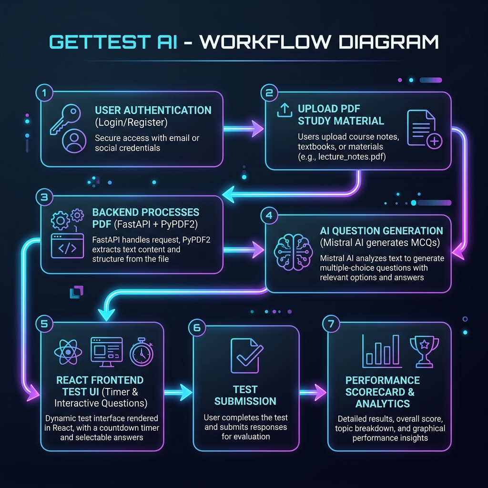

<p align="center">
  
</p>

<h1 align="center">GetTest AI</h1>

<p align="center">
  <strong>An AI-Powered Mock Test Platform</strong>
</p>

<p align="center">
  <a href="https://gettest-ai.vercel.app/"><strong>Explore the Live Site »</strong></a>
</p>

<p align="center">
  
  
  
  
  
</p>

---

## ⚙️ Core Features

*   🧠 **AI-Powered Question Generation**: Upload PDFs of study materials or textbook chapters. GetTest AI parses the content and uses advanced LLMs (Mistral AI via OpenRouter) to instantly generate relevant, context-rich Multiple Choice Questions (MCQs).
*   🧪 **Interactive Mock Test System**: A robust, user-friendly test interface containing interactive navigation, timers tracking time spent per question, and instant flag options.
*   📊 **Deep Performance Analytics**: Track your marks, test history, accuracy metrics, and time distributions using beautiful charts powered by `Recharts` and `Chart.js`.
*   👤 **Secure Profiles & OAuth**: Register and log in using email credentials or authenticate seamlessly using Google OAuth integration. Manage customized details like name, avatar, gender, and bio.
*   💳 **Integrated Monetization**: Checkout using payment plans powered by Cashfree sandbox integration for mock test access tier upgrades.

---

## 🗺️ Functional Flow Chart

The following diagram illustrates the lifecycle of a request in GetTest AI, starting from user authentication and PDF upload, through processing, AI question generation, test execution, and analytics tracking:



### Logical Workflow Breakdown

1.  **User Authentication & Authorization**: Users authenticate via React Frontend. Requests are routed through FastAPI. Secures routes via JWT or Google OAuth callbacks. Sessions/user info are persisted in MongoDB.
2.  **PDF Parsing**: When a user selects a PDF document to generate questions, the PDF is processed on the FastAPI backend using `PyPDF2`, converting text data into clean payloads.
3.  **AI Question Processing**: The parsed text is parsed, segmented, and combined with carefully structured prompt templates. This is dispatched to Mistral AI/OpenRouter. The LLM responds with a standardized JSON schema containing questions, correct answers, options, and explanations.
4.  **Mock Test Delivery**: The generated questions are served to the client-side React UI where the user completes the exam with question-level timers running.
5.  **Score Submission & Analytics**: On submission, the answers are graded, scores are calculated, and historical logs are updated in MongoDB Atlas. Performance metrics are parsed on the client and mapped to the dashboard via charts.

---

## 🛠️ Tech Stack

*   **Frontend**: React.js, Tailwind CSS (v4), Axios, Recharts, Chart.js, Framer Motion, React Router DOM
*   **Backend**: FastAPI (Python), PyPDF2, Uvicorn, Motor (Async MongoDB Driver)
*   **Database**: MongoDB Atlas
*   **Authentication & Services**: Google OAuth, Supabase services, Cashfree Payment Gateway
*   **AI Integration**: Mistral AI / OpenRouter API

---

## 🚀 Local Installation & Setup

Follow these steps to run GetTest AI on your local environment:

### Prerequisites
*   Node.js (v18+) & npm
*   Python 3.10+
*   MongoDB Atlas cluster (or local MongoDB)
*   API keys for Mistral AI/OpenRouter, Supabase, and Google OAuth credentials

---

### Backend Setup

1.  **Navigate to the server directory**:
    ```bash
    cd server
    ```

2.  **Create and activate a Python virtual environment**:
    *   **Windows (PowerShell)**:
        ```powershell
        python -m venv venv
        .\venv\Scripts\Activate.ps1
        ```
    *   **macOS / Linux**:
        ```bash
        python3 -m venv venv
        source venv/bin/activate
        ```

3.  **Install dependencies**:
    ```bash
    pip install -r requirements.txt
    ```

4.  **Configure Environment Variables**:
    Create a `.env` file in the `server` directory and fill in the values:
    ```env
    Mistral_API_KEY=your_mistral_api_key
    OPENROUTER_API_KEY=your_openrouter_api_key
    MONGO_URI=your_mongodb_connection_string
    DB_NAME=gettestai
    JWT_SECRET=your_jwt_secret_key
    JWT_ALGORITHM=HS256
    
    SUPABASE_URL=your_supabase_url
    SUPABASE_KEY=your_supabase_anon_key
    SUPABASE_SERVICE_ROLE_KEY=your_supabase_service_role_key
    
    CASHFREE_APP_ID=your_cashfree_app_id
    CASHFREE_SECRET_KEY=your_cashfree_secret_key
    CASHFREE_BASE_URL=https://sandbox.cashfree.com/pg
    
    BACKEND_URL=http://localhost:8000
    APP_URL=http://localhost:8000
    FRONTEND_URL=http://localhost:5173
    
    GOOGLE_CLIENT_ID=your_google_client_id
    GOOGLE_CLIENT_SECRET=your_google_client_secret
    GOOGLE_REDIRECT_URI=http://127.0.0.1:8000/auth/google/callback
    ```

5.  **Run the Server**:
    ```bash
    uvicorn main:app --reload
    ```
    The backend will run at [http://localhost:8000](http://localhost:8000).

---

### Frontend Setup

1.  **Navigate to the client directory**:
    ```bash
    cd ../client
    ```

2.  **Install npm packages**:
    ```bash
    npm install
    ```

3.  **Configure Environment Variables**:
    Create a `.env` file in the `client` directory:
    ```env
    VITE_BACKEND_URL=http://localhost:8000
    VITE_FRONTEND_URL=http://localhost:5173
    VITE_SUPABASE_URL=your_supabase_callback_url
    VITE_SUPABASE_ANON_KEY=your_supabase_anon_key
    ```

4.  **Start the Vite development server**:
    ```bash
    npm run dev
    ```
    Open your browser and navigate to [http://localhost:5173](http://localhost:5173).

---

## 🤝 How to Contribute

We welcome contributions to GetTest AI! Please follow these guidelines to ensure smooth collaboration.

### 🌿 Development Workflow

1.  **Fork and Clone**:
    Fork the repository on GitHub and clone your fork locally:
    ```bash
    git clone https://github.com/your-username/GetTest-AI.git
    cd GetTest-AI
    ```

2.  **Branching Conventions**:
    Create a new feature branch from `main`. Use a descriptive name prefixed with the type of work:
    *   Features: `feature/your-feature-name`
    *   Bug fixes: `bugfix/issue-description`
    *   Documentation: `docs/readme-updates`
    *   Refactoring: `refactor/clean-auth`
    
    Example:
    ```bash
    git checkout -b feature/pdf-caching
    ```

3.  **Code Styling & Linting**:
    - **Frontend**: Check for syntax errors and warnings using ESLint before committing changes:
      ```bash
      npm run lint
      ```
    - **Backend**: Adhere to PEP 8 style guidelines. Write clean docstrings and comments.

4.  **Local Testing**:
    - Before requesting a pull request, run your changes locally and verify that the front-to-back integration functions correctly.
    - Test edge cases such as network timeouts, large PDF files, and invalid login attempts.

5.  **Submitting a Pull Request (PR)**:
    - Commit your changes with concise and informative commit messages.
    - Push your feature branch to your GitHub fork:
      ```bash
      git push origin feature/your-feature-name
      ```
    - Open a Pull Request against the original repository's `main` branch.
    - Provide a detailed summary of your changes, what you tested, and any visual assets (screenshots/recordings) of UI adjustments.
    - Wait for reviews and resolve any requested changes.

